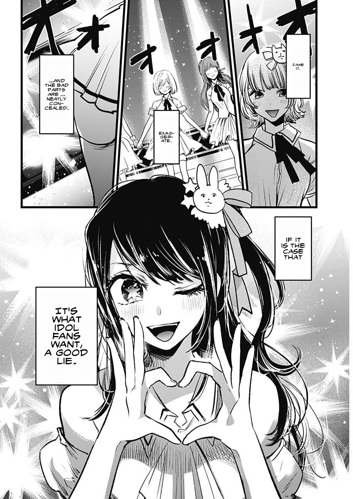

# Manga Translator


## Why ?

- Boy read manga.
- Boy reach latest chapter.
- Chapter not translated.
- Boy get mad.
- Boy do code instead of waiting like a normal person.

## How ?

- [Yolo](https://github.com/ultralytics/ultralytics) for bubble recognition and text segmentation
- Open CV for bubble and masking
- PIL for text replacement
- Api's or neural networks for translation
- Deepfillv2 for inpainting and bubble cleanup

## Progress

- [x] Bubble inpainting using [deepfillv2](https://arxiv.org/abs/1806.03589) credit to [nipponjo](https://github.com/nipponjo) and his [implementation](https://github.com/TareHimself/deepfillv2-pytorch)
- [x] Bubble recognition (should improve with more training data)
- [x] Free text recognition (should improve with more training data)
- [x] Bubble text extraction
- [x] Bubble masking
- [x] Bubble text insertion
- [x] Bubble Text ocr
- [x] Bubble Text translation
- [x] Bubble Text hypenation
- [x] Ensure Repo works on M1
- [x] Format and structure dataset
- [x] Create converters i.e. yolo => coco, my dataset => yolo etc
- [ ] Create Korean ocr model or finetune existing
- [ ] Create Chinese ocr model or finetune existing
- [ ] Free text ocr
- [ ] Free text translation
- [ ] Improve text resize algorithm, some texts are too small/big

## Models

- [Detection](https://pixeldrain.com/u/hjjU79dU)
- [Segmentation](https://pixeldrain.com/u/675HkiHx)
- [Inpainting](https://pixeldrain.com/u/Qxnfugrj)
- [Color Detection](https://pixeldrain.com/u/f6drbee1)

## Install

- setup [Anaconda](https://www.anaconda.com/download)
- clone this repository
- Open a terimal in the cloned repository
- Run the following in the terminal to create an enviroment
```py
conda create -n manga-translator python=3.9.12
conda activate manga-translator
```
- Install [Poetry](https://python-poetry.org/)
- Run the following in the enviroment we created

```bash
poetry install
# For cuda support run "poe force-cuda"
```
- Download models to models/modelname (i.e. models/detection.py)
- If you plan to use the UI also install [NodeJS](https://nodejs.org/en)

## Run
### UI
```bash
poe build-ui
poe run-server
```

### CLI
```bash
python main.py -m [live|convert -f "files"]
```

## Datasets

### Detection

<a href="https://universe.roboflow.com/tarehimself/manga-translator-detection">
    </img>
</a>

### Segmentation

<a href="https://universe.roboflow.com/tarehimself/manga-translator-segmentation">
    </img>
</a>

## Examples




## Glossary

- Bubble: a speech bubble
- Free text: text found on pages but not in speech bubbles
- Bubble Text: text within speech bubbles
