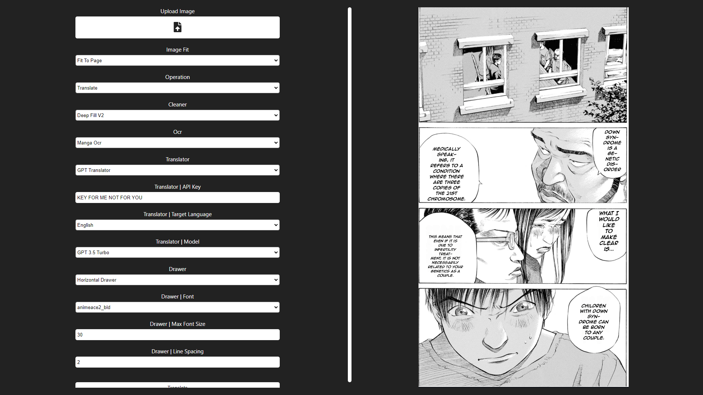
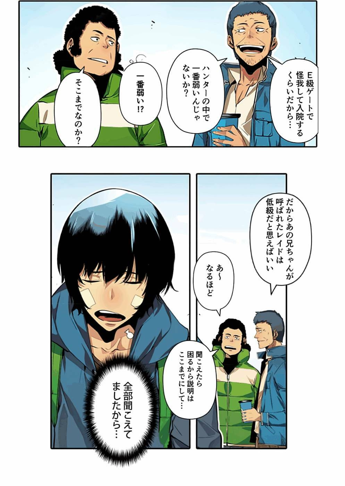
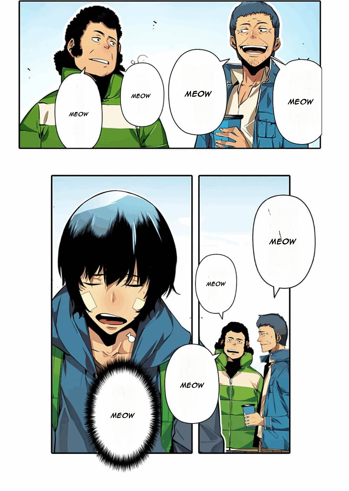
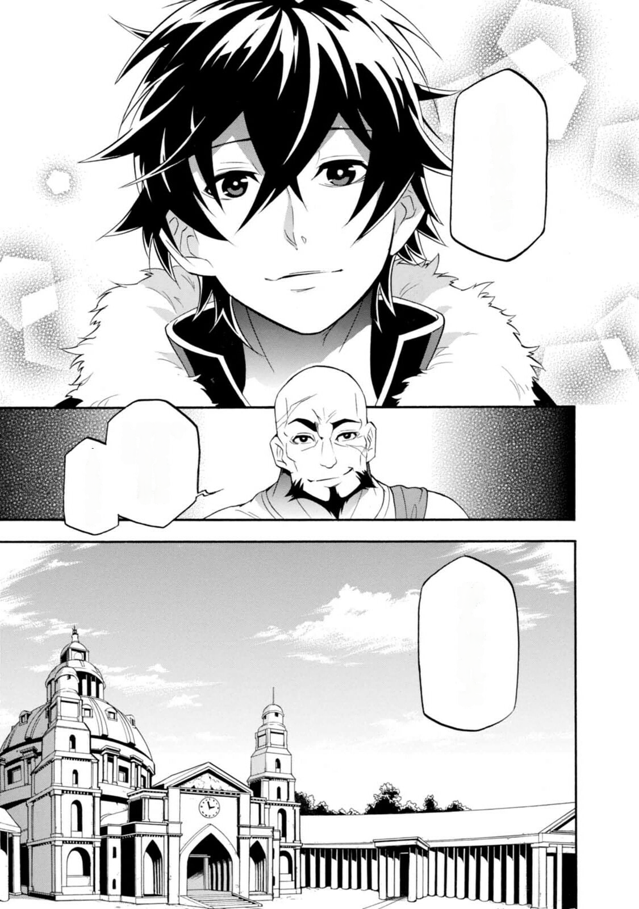

# Manga Translator



## Why ?

- Boy read manga.
- Boy reach latest chapter.
- Chapter not translated.
- Boy get mad.
- Boy do code instead of waiting like a normal person.

## How ?

- [Yolo](https://github.com/ultralytics/ultralytics) for bubble recognition and text segmentation
- Open CV for bubble and masking
- PIL for text replacement
- Api's or neural networks for translation
- Deepfillv2 for inpainting and bubble cleanup

## Progress

- [x] Bubble inpainting using [deepfillv2](https://arxiv.org/abs/1806.03589) credit to [nipponjo](https://github.com/nipponjo) and his [implementation](https://github.com/TareHimself/deepfillv2-pytorch)
- [x] Bubble recognition (should improve with more training data)
- [x] Free text recognition (should improve with more training data)
- [x] Bubble text extraction
- [x] Bubble masking
- [x] Bubble text insertion
- [x] Bubble Text ocr
- [x] Bubble Text translation
- [x] Bubble Text hypenation
- [x] Format and structure dataset
- [x] Create converters i.e. yolo => coco, my dataset => yolo etc
- [ ] Better free text ocr
- [ ] Better free text translation
- [ ] Add more inpainting options i.e sd
- [ ] Improve text resize algorithm, some texts are too small/big
- [ ] Implement "https://github.com/advimman/lama" for cleaning

## Models

- Available in the latest release

## Install

- setup [Anaconda](https://www.anaconda.com/download)
- clone this repository
- Open a terimal in the cloned repository
- Run the following in the terminal to create an enviroment

```py
conda create -n manga-translator python=3.9.12
conda activate manga-translator
```

- Install [Poetry](https://python-poetry.org/)
- Run the following in the enviroment we created

```bash
poetry install
poe install-deps
# For cuda support run "poe force-cuda"
```

- Download models to models/modelname (i.e. models/detection.py)
- If you plan to use the UI also install [NodeJS](https://nodejs.org/en)

## Run

### UI

```bash
poe run-server
```

### CLI

```bash
python main.py -m [live|convert -f "files"]
```

## Datasets

### Detection

<a href="https://universe.roboflow.com/tarehimself/manga-translator-detection">
    </img>
</a>

### Segmentation

<a href="https://universe.roboflow.com/tarehimself/manga-translator-segmentation">
    </img>
</a>

## assets/examples

<table>
   <thead>
      <tr>
         <th align="center" width="50%">Original</th>
         <th align="center" width="50%">Translated</th>
      </tr>
   </thead>
   <tbody>
      <tr>
         <td align="center" width="50%">
            
         </td>
         <td align="center" width="50%">
            
         </td>
      </tr>
      <tr>
         <td colspan=2 align="center">Japanese => English</br>Jujutsu Kaisen</td>
      </tr>
      <tr>
         <td align="center" width="50%">
            
         </td>
         <td align="center" width="50%">
            
         </td>
      </tr>
      <tr>
         <td colspan=2 align="center">Japanese => "Meow"</br>Solo Leveling</td>
      </tr>
      <tr>
         <td align="center" width="50%">
            
         </td>
         <td align="center" width="50%">
            
         </td>
      </tr>
      <tr>
         <td colspan=2 align="center">Japanese => Clean</br>The Rising of the Shield Hero</td>
      </tr>
      <tr>
         <td align="center" width="50%">
            
         </td>
         <td align="center" width="50%">
            
         </td>
      </tr>
      <tr>
         <td colspan=2 align="center">Japanese => English</br>A Certain Scientific Accelerator</td>
      </tr>
      <tr>
         <td align="center" width="50%">
            
         </td>
         <td align="center" width="50%">
            
         </td>
      </tr>
      <tr>
         <td colspan=2 align="center">Japanese => English</br>One Punch Man</td>
      </tr>
      <tr>
         <td align="center" width="50%">
            
         </td>
         <td align="center" width="50%">
            
         </td>
      </tr>
      <tr>
         <td colspan=2 align="center">Japanese => English</br>Oshi No Ko</td>
      </tr>
   </tbody>
</table>

## Glossary

- Bubble: a speech bubble
- Free text: text found on pages but not in speech bubbles
- Bubble Text: text within speech bubbles
