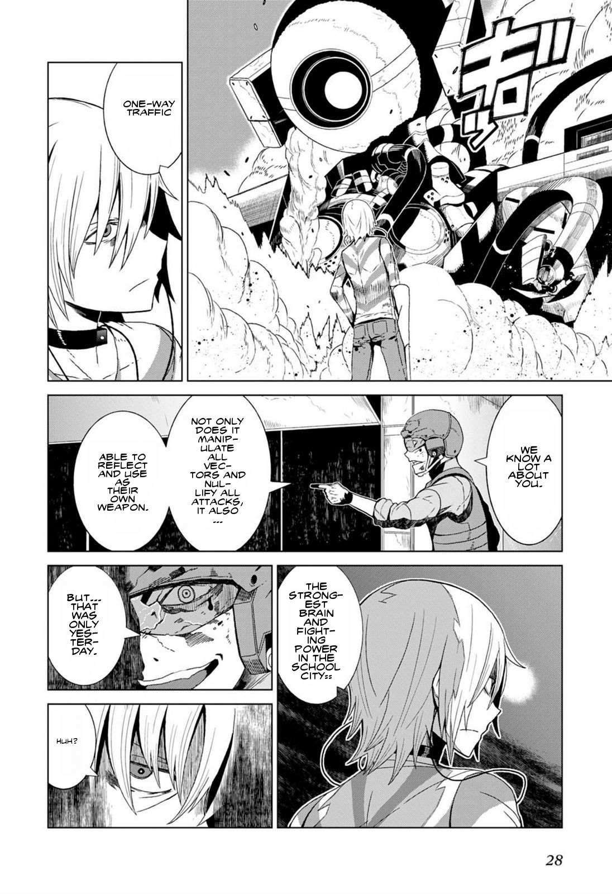
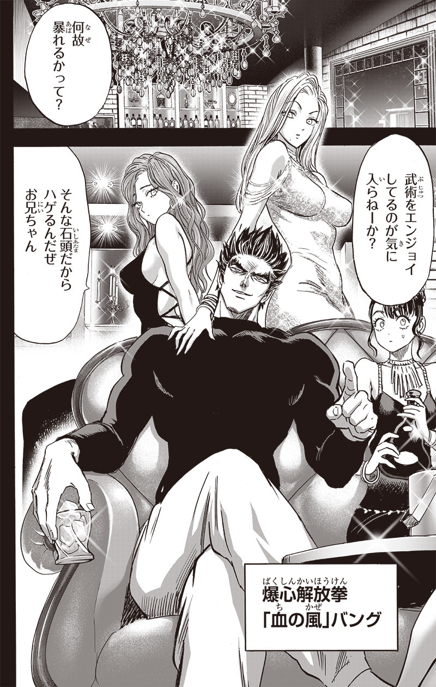
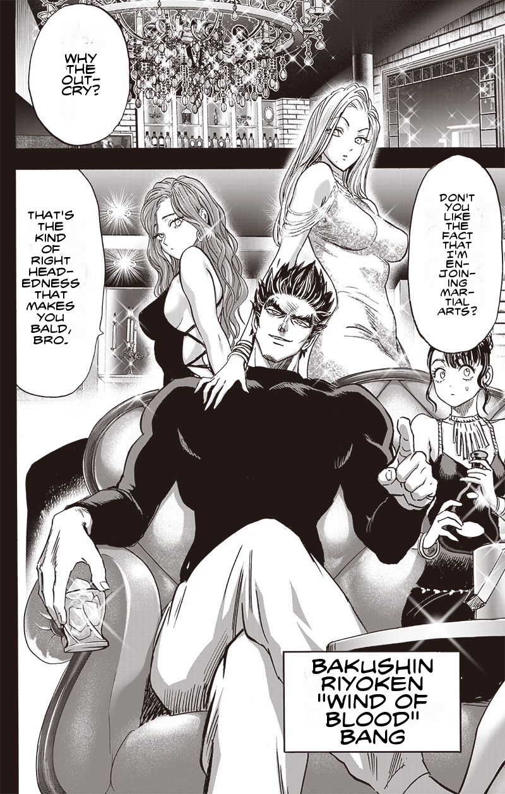
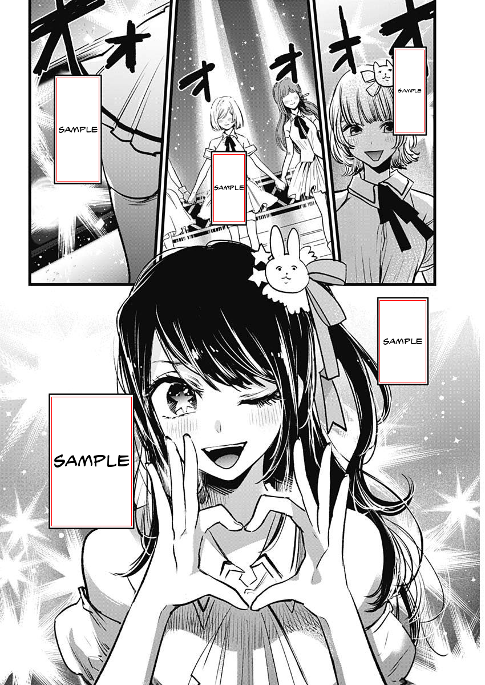

# Manga Translator

## Why ?

A long, long, long time ago, a wee lad was reading a manga. It was such a blissfull read for this wee lad before he realized and before he realized it he had reached the last page.Curious on the next release this lad hoped on the web to find answers only to that the manga was no longer being translated. Stricken by grief this wee lad set out to right this wrong.

## How ?

- [Yolo](https://github.com/ultralytics/ultralytics) for bubble recognition and text segmentation
- Open CV for bubble clean up and masking
- PIL for text replacement
- Have not decided on ocr tech or translation method

## Progress

- [x] Bubble recognition (should improve with more training data)
- [x] Free text recognition (should improve with more training data)
- [x] Bubble text extraction
- [x] Bubble masking
- [x] Bubble text insertion
- [ ] Bubble Text ocr
- [x] Bubble Text translation
- [ ] Bubble Text hypenation
- [ ] Create Korean ocr model or finetune existing
- [ ] Create Chinese ocr model or finetune existing
- [x] Ensure Repo works on M1
- [x] Format and structure dataset
- [x] Create converters i.e. yolo => coco, my dataset => yolo etc
- [ ] Free text ocr
- [ ] Free text translation
- [ ] Improve text resize algorithm, some texts are too small/big

## Run

```
conda create -n manga-translator python=3.9.12
conda activate manga-translator
python -m pip install -r requirements.txt
python main.py -m [live|convert -f "files"]
```

## Datasets

### Detection

<a href="https://universe.roboflow.com/tarehimself/manga-translator-detection">
    </img>
</a>

### Segmentation

<a href="https://universe.roboflow.com/tarehimself/manga-translator-segmentation">
    </img>
</a>

## Examples







## Glossary

- Bubble: a speech bubble
- Free text: text found on pages but not in speech bubbles
- Bubble Text: text within speech bubbles
